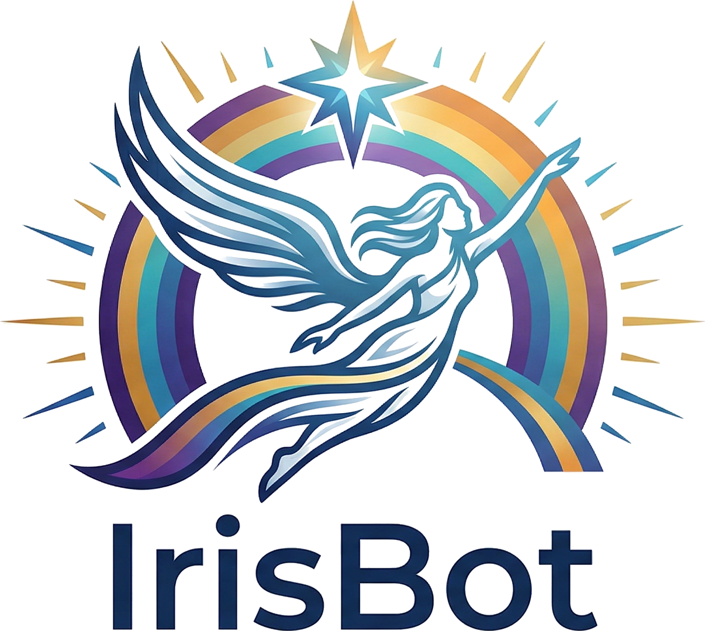

# IrisBot

A multi-provider Slack AI bot built with the [Vercel AI SDK](https://sdk.vercel.ai/). Switch between LLM providers (Gemini, OpenAI, Nebius) and user-selectable personas. Interact via Slack mentions, DMs, slash commands, and an App Home UI.



## Features

- **Multi-provider** — switch between Gemini, OpenAI, and Nebius at runtime
- **Personas** — General (🃏), Property Management (🏠), Software Engineering (💻)
- **Conversation memory** — per-thread/DM context with 4-hour TTL
- **Multiple interaction modes** — mentions, DMs, `/ask`, `/mode`, App Home
- **Socket Mode** — no public endpoint required

## Prerequisites

- Node.js 18+
- pnpm
- A [Slack app](https://api.slack.com/apps) with Socket Mode enabled

## Setup

1. Clone and install dependencies:

   ```bash
   git clone <repo>
   cd IrisBot
   pnpm install
   ```

2. Copy `.env.example` to `.env` and fill in your credentials:

   ```bash
   cp .env.example .env
   ```

3. Configure your Slack app (see [Slack App Configuration](#slack-app-configuration) below).

## Environment Variables

| Variable | Required | Description |
|----------|----------|-------------|
| `SLACK_BOT_TOKEN` | Yes | Bot user OAuth token (`xoxb-...`) |
| `SLACK_APP_TOKEN` | Yes | App-level token for Socket Mode (`xapp-...`) |
| `SLACK_SIGNING_SECRET` | Yes | Request signing verification |
| `GOOGLE_GENERATIVE_AI_API_KEY` | For Gemini | Gemini API key |
| `OPENAI_API_KEY` | For OpenAI | OpenAI API key |
| `NEBIUS_API_KEY` | For Nebius | Nebius API key |
| `DEFAULT_PROVIDER` | No | `gemini` \| `openai` \| `nebius` (default: `gemini`) |
| `PORT` | No | HTTP port (default: `3000`) |
| `LOG_LEVEL` | No | `debug` \| `info` \| `warn` \| `error` (default: `info`) |
| `NODE_ENV` | No | `development` \| `production` |

## Development

```bash
pnpm dev        # ts-node + nodemon watch (auto-reload)
pnpm build      # compile to dist/
pnpm start      # run dist/index.js
pnpm typecheck  # type-check without emit
```

## Slack App Configuration

In your [Slack app settings](https://api.slack.com/apps):

**OAuth & Permissions — Bot Token Scopes:**
- `app_mentions:read`
- `chat:write`
- `commands`
- `im:history`
- `im:read`
- `im:write`

**Event Subscriptions — Subscribe to bot events:**
- `app_home_opened`
- `app_mention`
- `message.im`

**Slash Commands:**
- `/ask` — Ask a question
- `/mode` — Switch persona

**App Home:** Enable the Home tab.

**Socket Mode:** Enable Socket Mode and generate an App-Level Token with `connections:write` scope.

## Usage

| Interaction | How |
|-------------|-----|
| Ask a question | Mention the bot: `@IrisBot what is X?` |
| DM the bot | Send a direct message |
| Slash command | `/ask your question here` |
| Switch persona | `/mode general` \| `/mode property` \| `/mode software` |
| App Home | Open the bot's Home tab for a full chat UI |

## Architecture

```
src/
├── index.ts          # Slack app init, handler registration
├── config.ts         # Zod-validated env config
├── types.ts          # Shared types
├── lib/
│   └── ai.ts         # Provider factory (Vercel AI SDK)
├── personas/
│   └── index.ts      # System prompts + per-user tracking
├── memory/
│   └── store.ts      # In-memory conversation history (TTL 4h)
├── handlers/
│   ├── mention.ts    # app_mention handler
│   ├── message.ts    # DM handler
│   ├── slash.ts      # /ask handler
│   ├── mode.ts       # /mode handler
│   └── home.ts       # App Home handler
└── blocks/
    └── homeView.ts   # Slack Block Kit home view
```

## License

Apache 2.0 — see [LICENSE](LICENSE).
